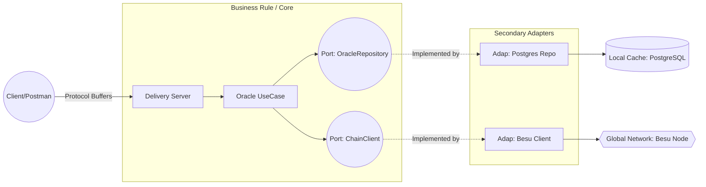

# Architecture Decision Record (ADR)

## System Topology

A variation of the **Hexagonal Architecture (Ports & Adapters)** combined with the **Adapter Design Pattern** was adopted to ensure that the oracle's business logic is never contaminated by external dependencies (such as the gRPC framework or persistence drivers).

The diagram below illustrates the data flow and the restricted dependency format:

- **Delivery (`app/internal/delivery`):** Exposes methods via gRPC. Isolates Protobuf serialization from the Core.
- **Usecase (`app/internal/usecase`):** Orchestration rules. Controls the flow of `Check` (state comparison) and `Sync`.
- **Repository (`app/internal/repository`):** Relational persistence utilizing `pgx/v5` for optimized PostgreSQL connection pooling.
- **Blockchain (`app/internal/blockchain`):** Adapter that implements the `go-ethereum` library, translating Foundry's ABI into JSON-RPC calls for the Besu node.

## Eventual Consistency and the "Oracle" Pattern

The Hyperledger Besu network acts as the "Absolute Source of Truth" (decentralized State Machine), while PostgreSQL works as a low-latency read replica (Off-Chain Cache).

The `Check` endpoint was specifically designed to act as an auditing heuristic, detecting divergences in the "Eventual Consistency" pattern if synchronization fails due to network conditions (e.g. P2P failures in Besu).

## Resilience and Error Handling

Any read or write timeout on the Besu P2P network is wrapped by the Go application and translated into native gRPC codes (e.g. `codes.Unavailable`), avoiding *panics* and ensuring the consuming client understands the infrastructure failure constructively via structured `log/slog` logging.

## 🔗 Theoretical References and Patterns (Design Patterns)

The application materializes complex software engineering concepts based on industry-standard bibliographies:

- **Hexagonal Architecture (Ports & Adapters)**: A methodology that prevents Core coupling to framework machinery, isolating the `Oracle UseCase` from any Web or SQL knowledge. [Alistair Cockburn's Archived Thesis](https://alistair.cockburn.us/hexagonal-architecture/).
- **Adapter Pattern (Wrapper)**: Actively used in the "Blockchain Layer". It allowed the wrapping of heavy `go-ethereum` packages safely beneath the lightweight `ChainClient` interface. [Read the official Pattern guide at Refactoring.Guru](https://refactoring.guru/design-patterns/adapter).
- **Eventual Consistency (CAP Theorem)**: Managing distributed databases means heavily weighing Availability against Global Partitioning. This theorem actively inspired the construction of the local `Check()` method. [Read about the CAP Theorem on IBM](https://www.ibm.com/topics/cap-theorem).
